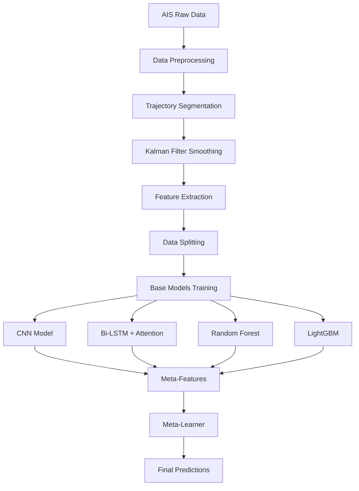

# Maritime Anomaly Detection

A professional machine learning pipeline for vessel type classification using Automatic Identification System (AIS) data. This project implements an ensemble learning approach combining deep learning (CNN, Bi-LSTM with Attention) and traditional machine learning models (Random Forest, LightGBM) through stacking.

## 🚢 Overview

Maritime vessel type classification is crucial for maritime domain awareness, traffic management, and security applications. This project processes AIS data to automatically classify vessels into different categories using advanced machine learning techniques.

### Key Features

- **Comprehensive Data Pipeline**: Complete data loading, preprocessing, and feature extraction
- **Advanced Feature Engineering**: Trajectory-based features with Kalman filter smoothing
- **Ensemble Learning**: Stacking ensemble combining multiple model types
- **Deep Learning Models**: CNN and Bi-LSTM with Attention for sequence classification
- **Traditional ML Models**: Random Forest and LightGBM with class balancing
- **Professional Code Structure**: Modular, maintainable, and well-documented codebase
- **Comprehensive Evaluation**: Detailed metrics and visualizations
- **Local Deployment**: Runs entirely on local machine without external dependencies

## 📊 Model Architecture



## 🛠️ Installation

### Prerequisites

- Python 3.8 or higher
- At least 8GB RAM (16GB recommended for full datasets)
- CUDA-compatible GPU (optional, for faster deep learning training)

### Setup

1. **Clone the repository**:
```bash
git clone https://github.com/yourusername/maritime-anomaly-detection.git
cd maritime-anomaly-detection
```

2. **Create virtual environment**:
```bash
python -m venv venv
source venv/bin/activate  # On Windows: venv\Scripts\activate
```

3. **Install dependencies**:
```bash
pip install -r requirements.txt
```

4. **Install the package**:
```bash
pip install -e .
```

## 📁 Data Requirements

The pipeline expects AIS data in CSV format with the following required columns:

- `MMSI`: Maritime Mobile Service Identity (9 digits)
- `LAT`: Latitude coordinates
- `LON`: Longitude coordinates
- `SOG`: Speed over Ground (knots)
- `COG`: Course over Ground (degrees)
- `VesselType`: Vessel type code
- `BaseDateTime`: Timestamp
- `Length`: Vessel length (meters)
- `Width`: Vessel width (meters)
- `Draft`: Vessel draft (meters, optional)

### Data Sources

- [MarineCadastre.gov](https://hub.marinecadastre.gov/pages/vesseltraffic) - US AIS data
- [USCG Navigation Center](https://www.navcen.uscg.gov/) - AIS specifications
- [EMODnet](https://www.emodnet-humanactivities.eu/) - European maritime data

## 🚀 Quick Start

### Basic Usage

```bash
# Run with ZIP file containing AIS data
python main.py --zip-file data/AIS_2024_10_24.zip --csv-name AIS_2024_10_24.csv

# Run in test mode with sample data
python main.py --zip-file data/AIS_2024_10_24.zip --csv-name AIS_2024_10_24.csv --test-mode

# Run smoke tests only
python main.py --smoke-tests-only
```

### Advanced Usage

```bash
# Use custom configuration
python main.py --config config.yaml --zip-file data/AIS_data.zip --csv-name AIS_data.csv

# Save model to custom location
python main.py --zip-file data/AIS_data.zip --csv-name AIS_data.csv --save-model models/my_model.joblib

# Load existing model and evaluate on new data
python main.py --load-model models/my_model.joblib --zip-file data/new_data.zip --csv-name new_data.csv

# Disable plotting and use custom output directory
python main.py --zip-file data/AIS_data.zip --csv-name AIS_data.csv --no-plots --output-dir results/
```

### Python API Usage

```python
from src.pipeline import MaritimePipeline
from src.config import config

# Create pipeline
pipeline = MaritimePipeline()

# Run complete pipeline
results = pipeline.run_complete_pipeline(
    zip_file_path="data/AIS_2024_10_24.zip",
    csv_file_name="AIS_2024_10_24.csv"
)

# Access results
print(f"Accuracy: {results['evaluation_results']['basic_metrics']['accuracy']:.4f}")

# Load saved model for inference
pipeline.load_model("data/models/ensemble_model.joblib")
predictions = pipeline.ensemble.predict(X_test, sequences_test)
```

## ⚙️ Configuration

The pipeline behavior can be customized through configuration files or environment variables:

```yaml
# config.yaml example
DEBUG: false
TEST_MODE: false

# Data parameters
MIN_MMSI_LENGTH: 9
MAX_SOG: 50.0
TARGET_VESSEL_TYPES: [37.0, 31.0, 52.0, 30.0, 70.0]

# Model parameters
EPOCHS: 15
N_ESTIMATORS: 150
CV_FOLDS: 5

# Output
SAVE_PLOTS: true
LOG_LEVEL: "INFO"
```

See `src/config/settings.py` for all available configuration options.

## 📈 Model Performance

### Vessel Types

The pipeline classifies vessels into the following categories:
- **37**: Pleasure craft
- **31**: Tug
- **52**: Tug
- **30**: Fishing vessel
- **70**: Cargo vessel
- **OTHER**: All other vessel types

### Expected Performance

On typical AIS datasets, the ensemble model achieves:
- **Accuracy**: 85-92%
- **F1-Score (Macro)**: 82-89%
- **F1-Score (Weighted)**: 85-92%

Performance may vary based on:
- Data quality and completeness
- Geographic region
- Temporal coverage
- Class distribution

## 🗂️ Project Structure

```
maritime_anomaly_detection/
├── src/                          # Source code
│   ├── config/                   # Configuration management
│   ├── data/                     # Data loading and preprocessing
│   ├── features/                 # Feature extraction and engineering
│   ├── models/                   # Machine learning models
│   ├── utils/                    # Utilities for metrics and visualization
│   └── pipeline.py               # Main pipeline orchestration
├── data/                         # Data directory
│   ├── raw/                      # Raw data files
│   ├── processed/                # Processed data
│   └── models/                   # Saved models
├── notebooks/                    # Jupyter notebooks for experiments
├── tests/                        # Unit tests
├── plots/                        # Generated visualizations
├── requirements.txt              # Python dependencies
├── setup.py                      # Package setup
├── main.py                       # Main entry point
└── README.md                     # This file
```

## 🔬 Technical Details

### Feature Engineering

The pipeline extracts comprehensive features from vessel trajectories:

**Static Features**:
- Vessel dimensions (length, width, draft)
- Length-to-width ratio
- Size category

**Dynamic Features**:
- Speed statistics (mean, std, max, min, range)
- Acceleration patterns
- Course and bearing analysis
- Operational patterns (stops, high-speed segments)
- Trajectory metrics (distance, duration, point density)

**Sequence Features**:
- Smoothed coordinate sequences (Kalman filtered)
- Speed over ground sequences
- Course over ground sequences

### Model Architecture

**Base Models**:
1. **CNN**: 1D Convolutional Neural Network for sequence patterns
2. **Bi-LSTM + Attention**: Bidirectional LSTM with attention mechanism
3. **Random Forest**: Balanced ensemble for feature-based classification
4. **LightGBM**: Gradient boosting for structured features

**Meta-Learning**:
- Logistic Regression meta-learner
- K-fold cross-validation for out-of-fold predictions
- Stacking ensemble combining all base model predictions

### Data Processing

**Preprocessing Steps**:
1. Data validation and cleaning
2. Vessel type reduction and mapping
3. Trajectory segmentation based on time gaps
4. Kalman filter smoothing for coordinate noise reduction
5. Feature extraction and engineering
6. Class balancing using SMOTE

## 🧪 Testing

Run the test suite:

```bash
# Run all tests
python -m pytest tests/

# Run specific test categories
python -m pytest tests/test_data.py
python -m pytest tests/test_models.py

# Run with coverage
python -m pytest tests/ --cov=src
```

Run smoke tests to verify installation:

```bash
python main.py --smoke-tests-only
```

## 📊 Evaluation and Visualization

The pipeline generates comprehensive evaluation metrics and visualizations:

**Metrics**:
- Accuracy, Precision, Recall, F1-scores
- Confusion matrices
- ROC and Precision-Recall curves
- Per-class performance metrics

**Visualizations**:
- Confusion matrix heatmaps
- ROC and PR curves
- Feature importance plots
- Model comparison charts
- Data distribution plots
- Comprehensive evaluation dashboard

## 🐛 Troubleshooting

### Common Issues

**Memory Issues**:
```bash
# Use test mode for large datasets
python main.py --test-mode --zip-file data/large_file.zip --csv-name data.csv
```

**CUDA/GPU Issues**:
```bash
# Force CPU usage
export CUDA_VISIBLE_DEVICES=""
python main.py --zip-file data/AIS_data.zip --csv-name data.csv
```

**Missing Dependencies**:
```bash
# Reinstall with force
pip install --force-reinstall -r requirements.txt
```

### Debug Mode

Enable debug logging for detailed information:

```bash
python main.py --log-level DEBUG --zip-file data/AIS_data.zip --csv-name data.csv
```

## 🤝 Contributing

We welcome contributions! Please see our contributing guidelines:

1. Fork the repository
2. Create a feature branch (`git checkout -b feature/amazing-feature`)
3. Make your changes
4. Add tests for new functionality
5. Ensure all tests pass (`python -m pytest`)
6. Commit your changes (`git commit -m 'Add amazing feature'`)
7. Push to the branch (`git push origin feature/amazing-feature`)
8. Open a Pull Request

### Development Setup

```bash
# Install development dependencies
pip install -r requirements.txt
pip install -e ".[dev]"

# Install pre-commit hooks
pre-commit install

# Run tests
python -m pytest

# Run linting
flake8 src/
black src/
```

## 📄 License

This project is licensed under the MIT License - see the [LICENSE](LICENSE) file for details.

## 🙏 Acknowledgments

- [MarineCadastre.gov](https://hub.marinecadastre.gov/) for providing AIS data
- [U.S. Coast Guard](https://www.navcen.uscg.gov/) for AIS specifications
- The open-source community for the excellent machine learning libraries

## 📞 Support

- **Issues**: [GitHub Issues](https://github.com/yourusername/maritime-anomaly-detection/issues)
- **Discussions**: [GitHub Discussions](https://github.com/yourusername/maritime-anomaly-detection/discussions)
- **Email**: your.email@example.com

## 📚 Citation

If you use this project in your research, please cite:

```bibtex
@software{maritime_anomaly_detection,
  title={Maritime Anomaly Detection: Vessel Type Classification using AIS Data},
  author={Your Name},
  year={2024},
  url={https://github.com/yourusername/maritime-anomaly-detection}
}
```

---

**Keywords**: Maritime, AIS, Vessel Classification, Machine Learning, Deep Learning, Ensemble Learning, Anomaly Detection, Time Series, Geospatial Analysis